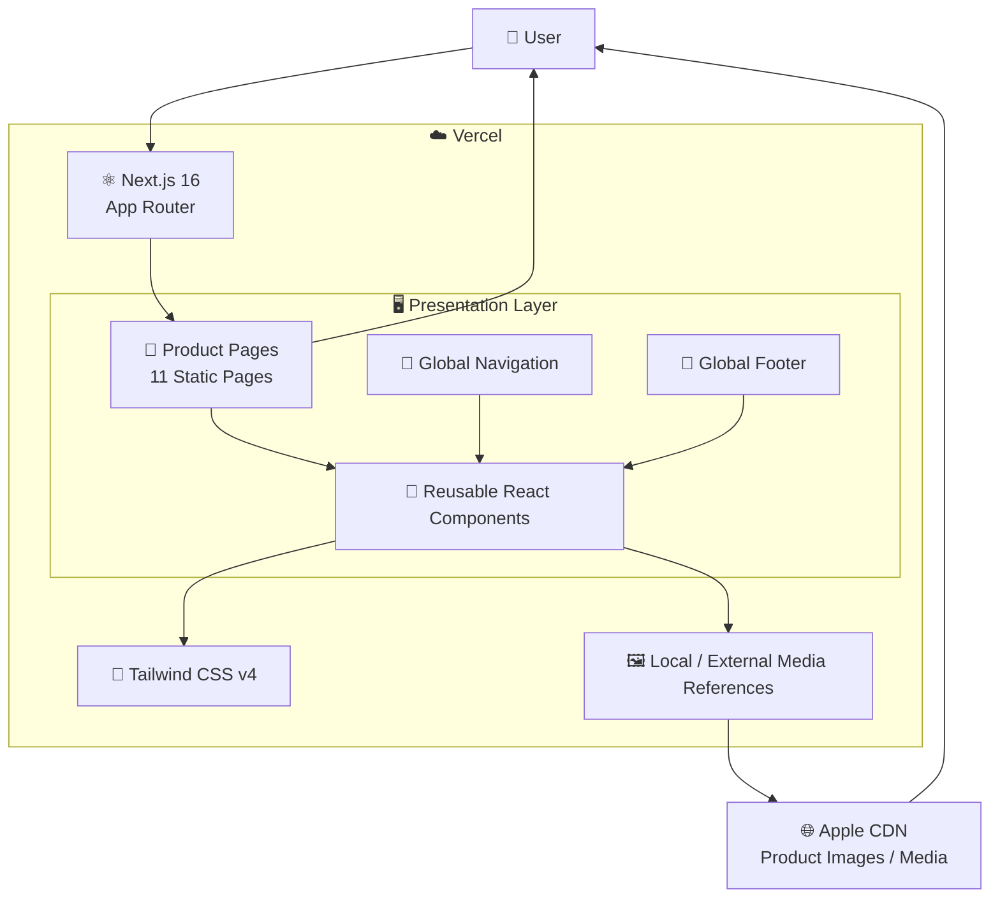
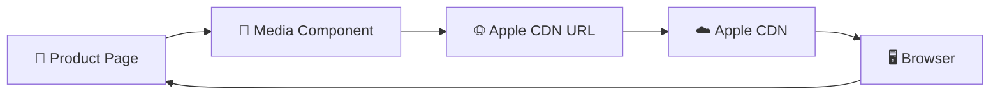

live demo : https://apple-website-seven.vercel.app/<!-- Link placeholder: add your project link here -->


# Apple Website Clone

A front-end clone of [apple.com](https://www.apple.com) built with **Next.js 16**, **TypeScript**, and **Tailwind CSS v4**.

## Features

- 11 static pages matching Apple's product lineup
- Real Apple CDN images per product card
- Video sections, animations, and responsive design
- Global Nav and Footer components

## Tech Stack

- Next.js 16 (Turbopack)
- TypeScript
- Tailwind CSS v4

## Getting Started

```bash
npm run dev
```

Open [http://localhost:3000](http://localhost:3000).

## Build

```bash
npm run build
```

## 🏗️ Architecture & Data Flow

The Apple Website Clone follows a **frontend-only, component-based Next.js architecture**. The application uses Next.js App Router for page routing, React components for reusable UI, Tailwind CSS for responsive styling, and external Apple CDN assets for product imagery and media.

<br />

### 🔄 High-Level Architecture



<br />

### 🧩 Component Architecture

The application follows a reusable component approach rather than building every page independently.

```text id="q8qj2s"
                    ⚛️ NEXT.JS APPLICATION
                             │
              ┌──────────────┼──────────────┐
              │              │              │
              ▼              ▼              ▼
        🧭 Global Nav    📄 Pages       🦶 Footer
                             │
                             ▼
                   🧩 Reusable Components
                             │
            ┌────────────────┼────────────────┐
            │                │                │
            ▼                ▼                ▼
       Product Cards     Hero Sections    Media Sections
            │                │                │
            └────────────────┼────────────────┘
                             ▼
                       🎨 Tailwind CSS
                             │
                             ▼
                        🖥️ Browser
```

<br />

### 📄 Page Rendering Flow

Each product page is rendered through the Next.js App Router.

```text id="6w7x9e"
👤 User
   │
   ▼
🌐 Product URL
   │
   ▼
⚛️ Next.js App Router
   │
   ▼
📄 Product Page
   │
   ├── 🧭 Global Navigation
   ├── 🖼️ Hero / Product Media
   ├── 🧩 Product Sections
   ├── 🎬 Video / Animation Sections
   └── 🦶 Global Footer
   │
   ▼
🖥️ Rendered Web Page
   │
   ▼
👤 User
```

<br />

### 🖼️ Product Media Flow

Product imagery and media are referenced from external Apple CDN resources.



The application itself does not need to store or serve every product image. The browser requests referenced media resources from the external CDN.

<br />

### 🎨 Styling Architecture

Tailwind CSS provides the styling layer across the application.

```text id="7y4q1f"
⚛️ React Components
        │
        ▼
🎨 Tailwind CSS v4
        │
        ├── Responsive Layout
        ├── Typography
        ├── Spacing
        ├── Product Sections
        └── Navigation / Footer
        │
        ▼
🖥️ Browser Rendering
```

Responsive utility classes allow the same component architecture to adapt across mobile, tablet, and desktop screen sizes.

<br />

### 🧭 Navigation Flow

The global navigation provides access to the different product pages.

```text id="w8p4hf"
👤 User
   │
   ▼
🧭 Global Navigation
   │
   ├── Product A
   ├── Product B
   ├── Product C
   ├── ...
   └── Product Pages
        │
        ▼
⚛️ Next.js App Router
        │
        ▼
📄 Selected Product Page
```

<br />

### ☁️ Deployment Architecture

The application is deployed as a Next.js frontend on Vercel.

```text id="0h6w9z"
                    👨‍💻 Developer
                         │
                         ▼
                   📦 GitHub Repo
                         │
                         ▼
                    ☁️ Vercel
                         │
                         ▼
                  ⚛️ Next.js Build
                         │
                         ▼
                  🌍 Production Site
                         │
               ┌─────────┴─────────┐
               │                   │
               ▼                   ▼
          📄 Web Pages       🌐 Apple CDN
               │                   │
               └─────────┬─────────┘
                         ▼
                      👤 User
```

<br />

### ⚡ Build & Development Flow

```text id="z2x8ec"
👨‍💻 Developer
     │
     ▼
📁 Source Code
     │
     ▼
⚛️ Next.js + TypeScript
     │
     ├── npm run dev
     │       │
     │       ▼
     │   💻 Local Development
     │
     └── npm run build
             │
             ▼
        📦 Production Build
             │
             ▼
          ☁️ Vercel
```

<br />

### 🧠 Architecture Principles

| Layer               | Responsibility                                       |
| ------------------- | ---------------------------------------------------- |
| **Next.js 16**      | Application framework, routing and page architecture |
| **React**           | Reusable component-based UI                          |
| **TypeScript**      | Type safety and maintainable code                    |
| **Tailwind CSS v4** | Responsive styling and layout                        |
| **Apple CDN**       | External product images and media                    |
| **Vercel**          | Production deployment and hosting                    |
| **Browser**         | Client-side rendering and interaction                |

<br />

### 🔁 Complete System Flow

```text id="g9q5rb"
                         👤 USER
                            │
                            ▼
                     ☁️ VERCEL
                            │
                            ▼
                  ⚛️ NEXT.JS APP
                            │
             ┌──────────────┼──────────────┐
             │              │              │
             ▼              ▼              ▼
        🧭 GLOBAL NAV   📄 PRODUCT PAGES   🦶 FOOTER
                            │
                            ▼
                   🧩 REUSABLE COMPONENTS
                            │
                  ┌─────────┴─────────┐
                  │                   │
                  ▼                   ▼
             🎨 TAILWIND        🌐 APPLE CDN
                  │                   │
                  └─────────┬─────────┘
                            ▼
                     🖥️ BROWSER UI
                            │
                            ▼
                         👤 USER
```

<br />

**Key architectural characteristic:** The Apple Website Clone is intentionally a **frontend-only application**. Next.js manages the page and component architecture, TypeScript provides type safety, Tailwind CSS handles responsive presentation, and external Apple CDN resources provide product media. No custom backend, database, authentication system, or application API is required for the current feature set.
